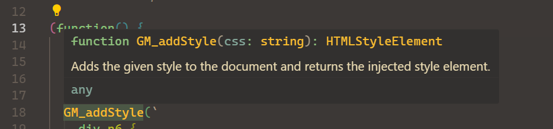

# Monkey Wrench

Adds support for userscripts including:

- Syntax highlighting
- Completion
- Hover
- Snippets
- Signature help
- Definitions / Type definitions

By default, any working with any file with the `.user.js` extension will activate the extension, though this behavior can be customized in the settings.

## Features

### Syntax Highlighting

Metadata key and value highlighting, similar to JS Doc highlighting.

*Metadata*

*CSS in `GM_addstyle`*

***

### Completion

Every metadata key accounted for, as well as every GM_* / GM.* function.

*Metadata*

*GM functions*

*GM functions*

***

### Hover

Full hover documentation and support for both metadata and functions.

*Metadata*

*Metadata*

*GM functions*

*GM functions*

***

### Snippets

Typing `userscript` will suggest a snippet to generate a userscript template. You can adjust the default values settings. Any metadata key that has an enumerated value associated with it will suggest those when typing.

*Userscript snippet*

***

### Signature Help

Every GM_* / GM.* function fully supported. Every metadata key also supported.

*GM functions*

*Metadata*

***

### Definitions / Type Definitions

Full typescript definitions included when right clicking a function and selecting `Go to Type Definition`.

<video src="./videos/type-definitions.mp4" autoplay loop muted playsinline poster="./images/type-definitions.png"></video>

## Release Notes

Please refer to the [CHANGELOG](./CHANGELOG.md).

## To Do
- Add images to documentation.
- Add more examples to documentation.
- Update signature help provider to better determine which overload is in use for those functions that have overloads.
- Add additional metadata defaults to user settings for the template snippet.

## License

